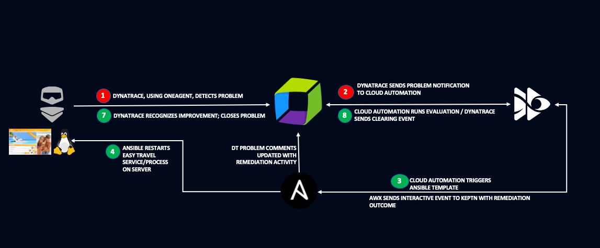

# AIOps - Leverage the power of Davis for Auto-Remediation 

Today’s IT environments are growing in terms of size and complexity. The speed of the digital marketplace requires an automated delivery pipeline and enhanced remediations in case of failures. End-to-end monitoring for enterprise applications can easily be automated. Not only does automation produce deterministic and consistent outcomes in large environments, it can also save you a lot of time.

## The application
We will be using an application called EasyTravel that provides a web portal which allows users to log in, search for journeys to various destinations, select promotional journeys directly that are offered and to book a journey using credit card details. 

## Remediation overview

