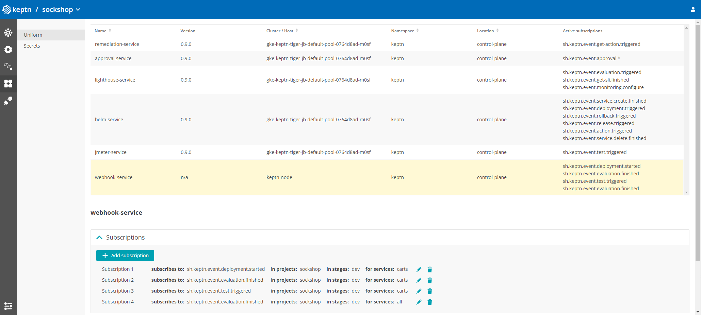
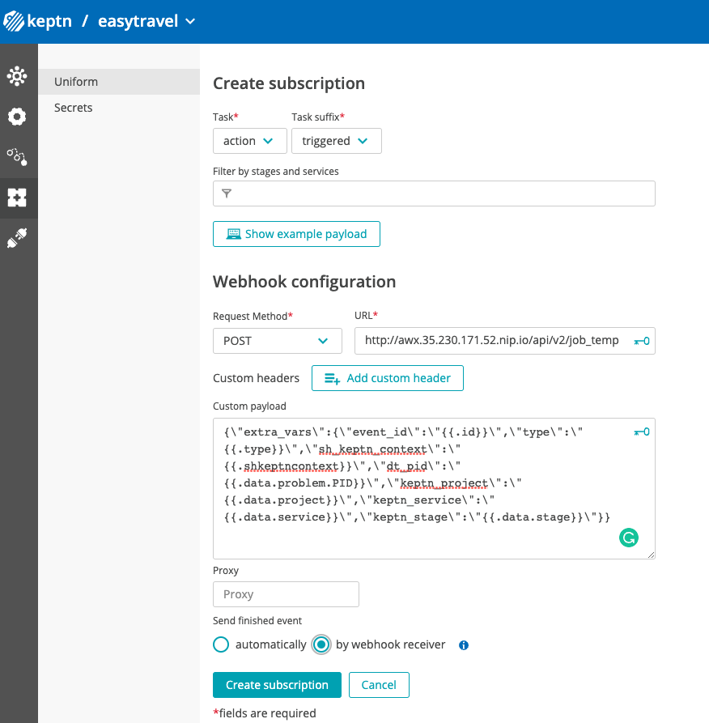

# Remediation options 

We have 3 different options when implementing remediation with Keptn and Dynatrace.

## Remediation using Webhooks

ref: https://keptn.sh/docs/0.11.x/integrations/webhooks/

In this exercise you will configure a remediation workflow using Keptn webhooks and Ansible AWX

### 1. Configure the weekhook Integration
1. Using ssh get into the folder `/home/ace/keptn/easytravel` and view the contents of th webhook.yaml file 
```(bash)
cd /home/ace/keptn/easytravel
```

1. Go to the Keptn Bridge (You can use the dashboard and select keptn Bridge link). The username will be admin and password dynatrace.
2. Get into easytravel project and select the 4th option from the left bar. It will display the current uniform and services installed. (
3.  Select the webhook-service from the uniform tab.
4. Select add subscription.
5. Create a new subscription using the following information (
6. There is currently a limitation in the payload that can be added and special characters are not being parsed correctly. In order to fix this limitation, we need to take additional steps.
7. Get into Gitea (you can use the dashboard and find the link to gitea) and navigate into the repo `http://gitea.xx.xx.xx.nip.io/perform/easytravel`
8. This repo contains all the configuration files added to the keptn project. We will modify the file located in 
`webhook/webhook.yaml` using the gitea online interface.
8. Replace the contents carefully by only modifying the curl command to match the one below.
```(yaml)
apiVersion: webhookconfig.keptn.sh/v1alpha1
kind: WebhookConfig
metadata:
  name: webhook-configuration
spec:
  webhooks:
    - type: sh.keptn.event.action.triggered
      requests:
        - "curl --header 'Authorization: Basic {{.env.secret_awx_token}}'
          --header 'Content-Type: application/json' --request POST --data
          '{\"extra_vars\":{\"event_id\":\"{{.id}}\",\"type\":\"{{.type}}\",\"sh_keptn_context\":\"{{.shkeptncontext}}\",\"dt_pid\":\"{{.data.problem.PID}}\",\"keptn_project\":\"{{.data.project}}\",\"keptn_service\":\"{{.data.service}}\",\"keptn_stage\":\"{{.data.stage}}\"}}'
          http://awx.35.230.171.52.nip.io/api/v2/job_templates/9/launch/"
      envFrom:
        - name: secret_awx_token
          secretRef:
            name: awx
            key: token
      subscriptionID: # subscription id from existing webhook
      sendFinished: false      
```


