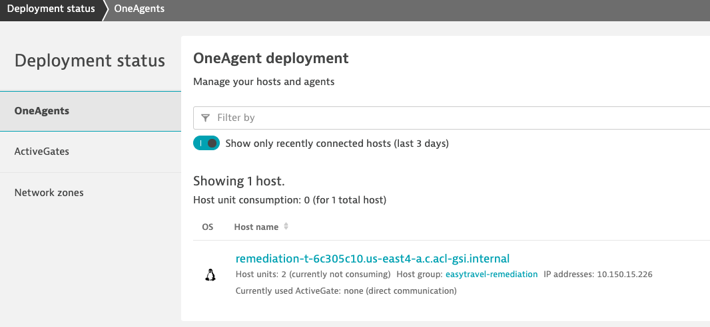

# Exercise 1 - Review & Setup environment

## Step 1 - Review current environment state

Review what has been configure in your environment.

Services already installed:

- ubuntu libraries including jq,git
- Docker service
- K3s as our kubernetes cluster
- One agent using the bash installation script 

1. Get into the development environment
using the web terminal or a ssh client log into your VM. (Check the provided credentials on the Dynatrace University).

2. Run the following command to visualize all the default pods running in your environment. 
    ```
    kubectl get po --all-namespaces 
    ```

3. Get into your Dynatrace instance and verify that the one agent is connected


## Step 2 - Install the first services

1. Make sure to have the required variables available. Run `env` and 
   check for the variable 

   If not present run `source ~/.bashrc` to refresh your variables before running the next script.
1. From your console run 
```(bash)
sudo -E bash /home/$shell_user/perform-2022-hot-aiops/install/setup-3.sh
```

 This script will execute the following:
 - Download the Keptn CLI
 - Install keptn in the Kubernetes cluster using helm
 - Install the ingress-nginx for service connectivity
 - Install the dynatrace-service for keptn
 - Configure the default keptn project
 
After the installation you should be able to navigate to the keptn bridge. (Check the console for more info).

---
[Next exercise](./exercise-2.md)