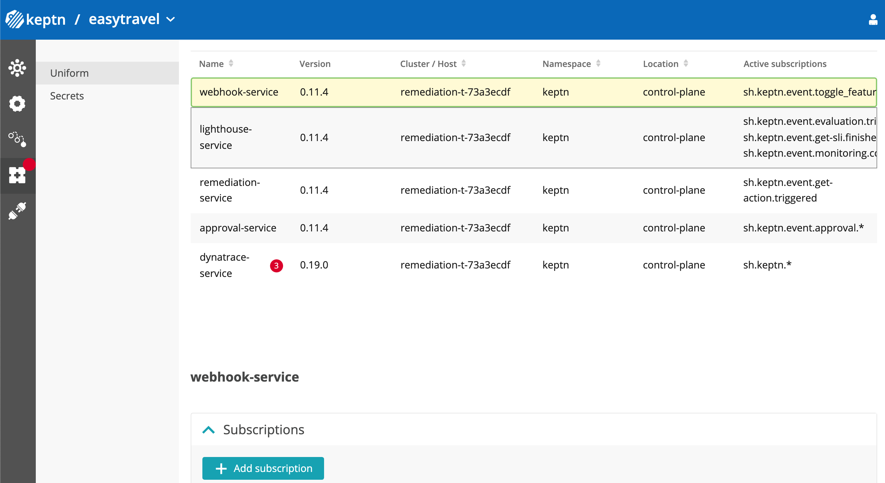
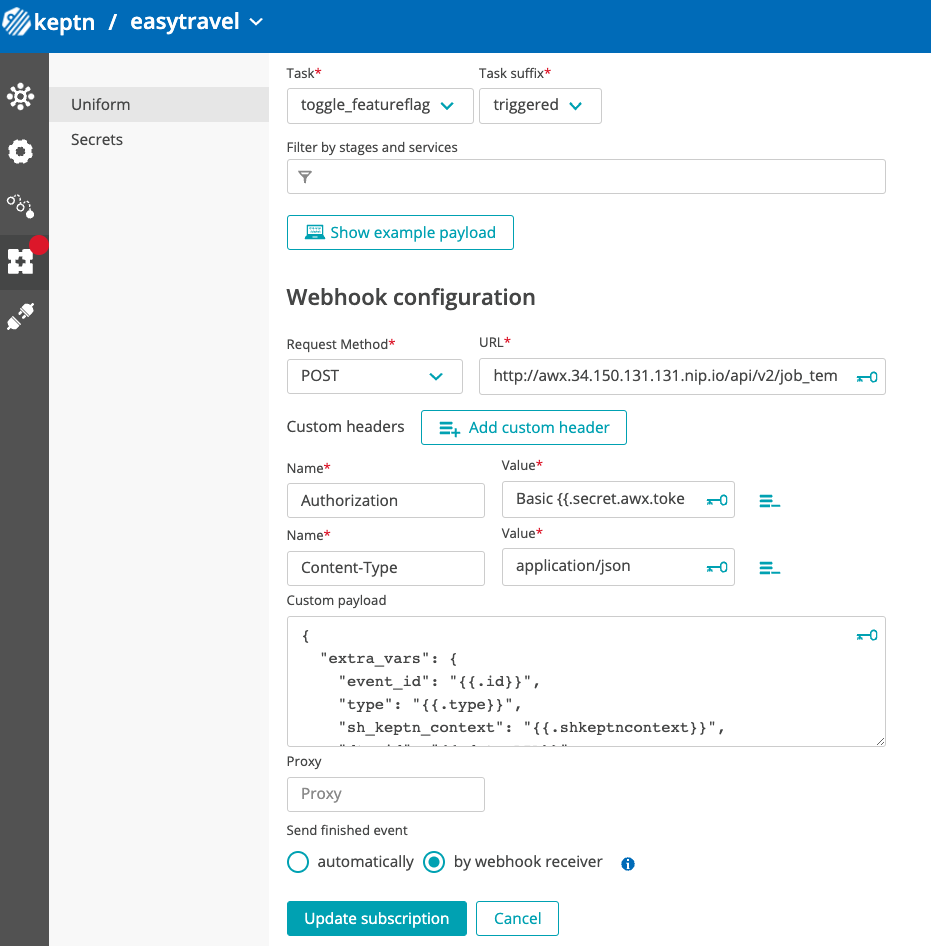
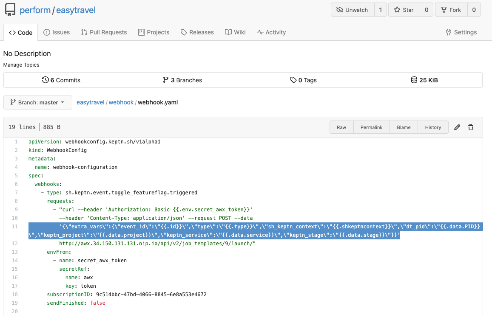

# Exercise 3 - Setup the remediation use case

 1. Execute ```source ~/.bashrc``` to refresh your bash command before executing the next command.
 1. From your console run 
      ```(bash)
      sudo -E bash /home/$shell_user/perform-2022-hot-aiops/install/setup-7.sh 
      ```
      This script will execute the following:
         - Create a git repository to store the EasyTravel remediation project
         - Configure a new Keptn project called easytravel with a remediation workflow.
         Take a look at the ```shipyard.yaml``` file in the gitea repository. (master branch)
         - Setup Dynatrace problem notification to send the problems to Keptn by using [Dynatrace as Code] (https://dynatrace-oss.github.io/dynatrace-monitoring-as-code)

 1. From your console run 
      ```(bash)
      sudo -E bash /home/$shell_user/perform-2022-hot-aiops/install/setup-8.sh 
      ```
      This script will execute the following:
      - Generate a template to create the webhook in keptn (we will use this to manually get into the UI and create the webhook)

 1. Create the webhook in Keptn.
      - Get into the keptn bridge and select the easytravel project. 
      - Select the webhook menu from the left bar 
      - Select the webhook service and add a subscription
      

1. Fill the form with the values from step 2. 
   (custom payload)
   ```
   {\"extra_vars\":{\"event_id\":\"{{.id}}\",\"type\":\"{{.type}}\",\"sh_keptn_context\":\"{{.shkeptncontext}}\",\"dt_pid\":\"{{.data.PID}}\",\"keptn_project\":\"{{.data.project}}\",\"keptn_service\":\"{{.data.service}}\",\"keptn_stage\":\"{{.data.stage}}\"}}
   ```   
   

1. (Temporal) Fix the webhook file. 
   There is a bug in the webhook service in Keptn, so we need to fix the way the Custom payload of the service is store. In order to do it, navigate to Gitea and locate the `webhook/webhook.yaml` file inside `easytravel` repo.

   Replace the body in the file with the body from the step 1. (Note: The original content has /// triple escape characters,  replacing the content fixes this issue)
   
---
[Next exercise](./exercise-4.md)