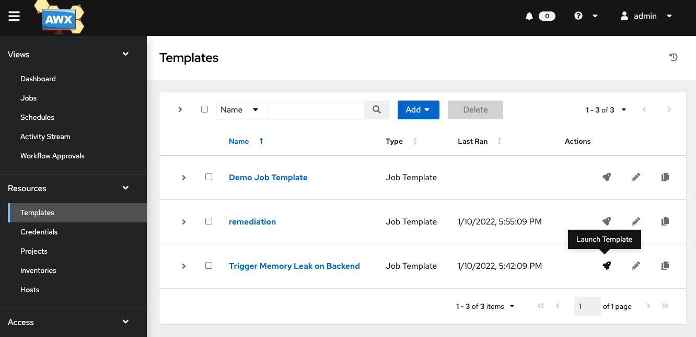

# Exercise 4 - Trigger initial remediation

- Navigate into the AWX UI. (you can use the dashboard to get the link and credentials)
- Select the template menu from the left 
- Run the playbook `Trigger Memory Leak on Backend` (click on the rocket icon)

- Get into Dynatrace and visualize the service Easytravel starting to get memory issues (This would appear as a process group problem)
- Wait for Dynatrace to open a problem (takes a few mins)
- After the problem is open Dynatrace will send a notification that will trigger a specific remediation workflow in keptn.
- Keptn will then execute the remediation workflow using the webhook subscription (this will trigger the ansible playbook)
- After the remediation is done ansible will send back a message with the remediation result
- Keptn will proceed to run a quality evaluation to make sure the remediation actually solved the problem. (If the issue is not solved then the problem will scalate to the next action)

[Next](./exercise-5.md)