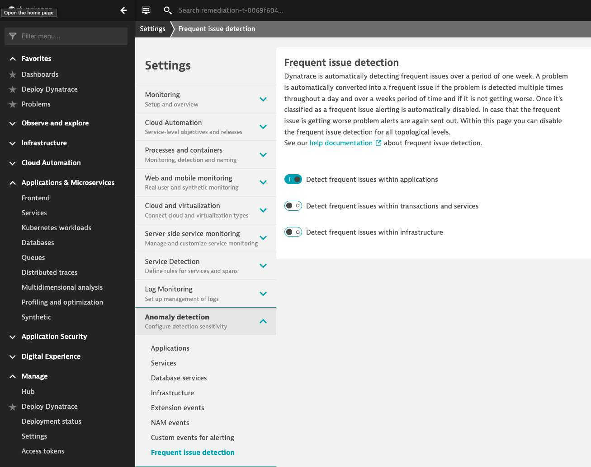
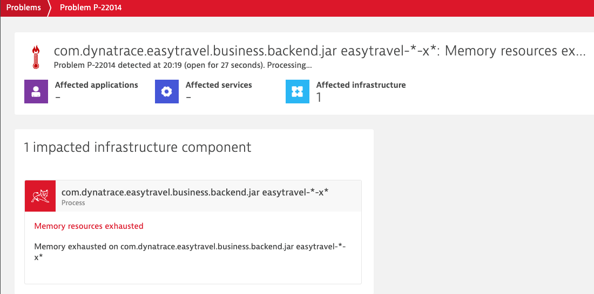
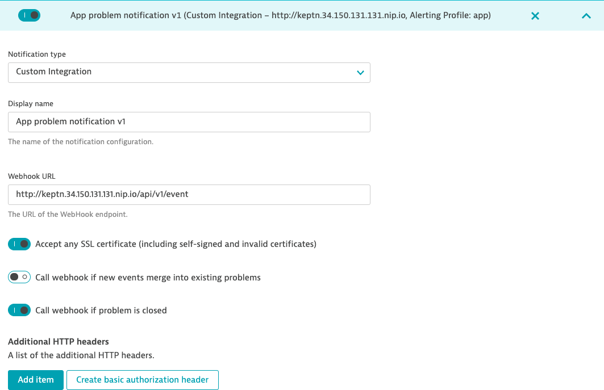
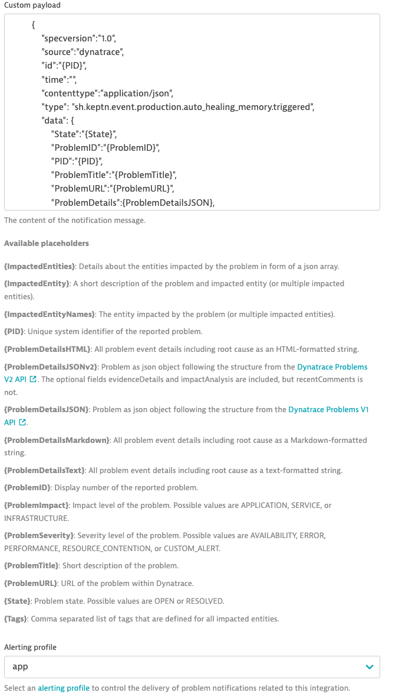
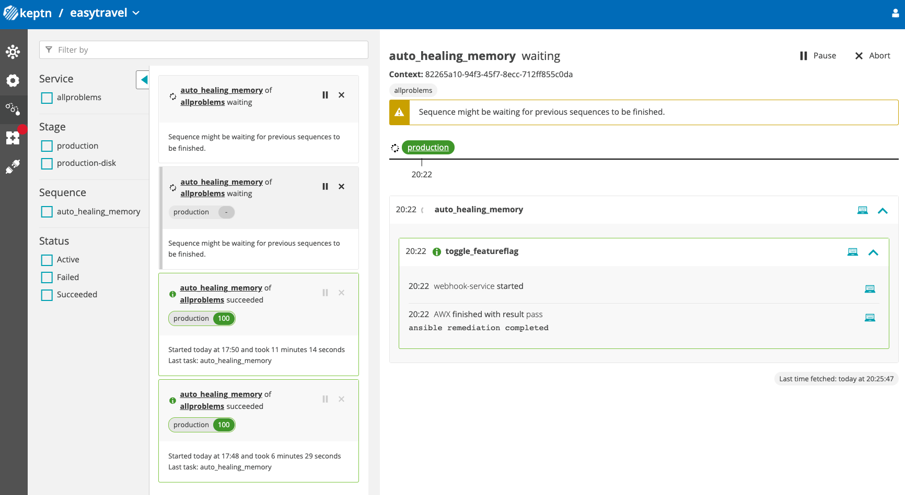
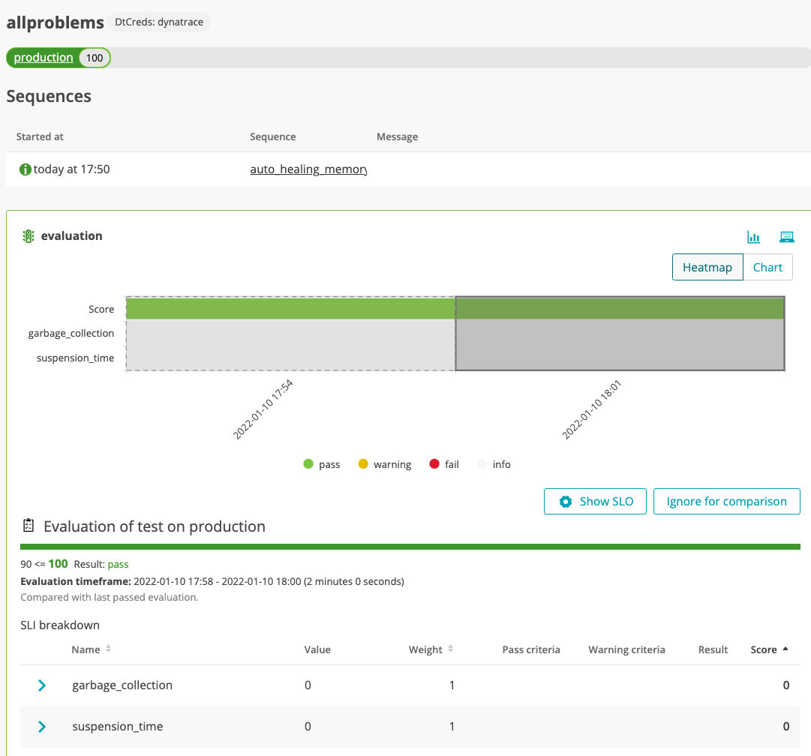

# Exercise 4 - Trigger initial remediation
1. Before triggering the problem we will disable frequent issue detection in Dynatrace to allow multiple tests using the same problem. (by default Dynatrace learns about the previous issues and avoids alerting again if it's a frequent issue. This would block our auto remediation process from being triggered).
 - Navigate into Dynatrace UI > Settings > Anomaly detection > Frequent issue detection and disable the feature for services and infraestructure.
 
1. Navigate into the AWX UI. (you can use the dashboard to get the link and credentials)
1. Select the template menu from the left 
1. Run the playbook `Trigger Memory Leak on Backend` (click on the rocket icon)

1. Get into Dynatrace and visualize the service Easytravel starting to get memory issues (This would appear as a process group problem)
1. Wait for Dynatrace to open a problem (takes a few mins)

1. After the problem is open Dynatrace will send a notification that will trigger a specific remediation workflow in keptn.

1. Keptn will then execute the remediation workflow using the webhook subscription (this will trigger the ansible playbook)

1. After the remediation is done ansible will send back a message with the remediation result (success or failure)
1. In case of success, Keptn will proceed to run a quality evaluation to make sure the remediation actually solved the problem. (If the issue is not solved then the problem will escalate to the next action)

---
[Next exercise](./exercise-5.md)