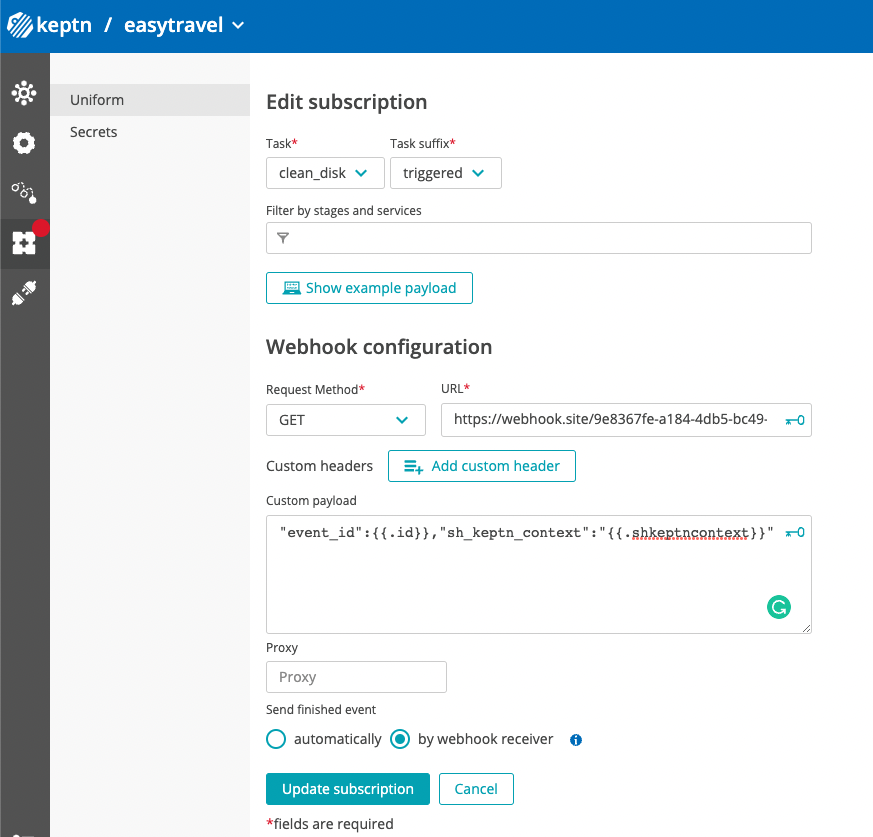
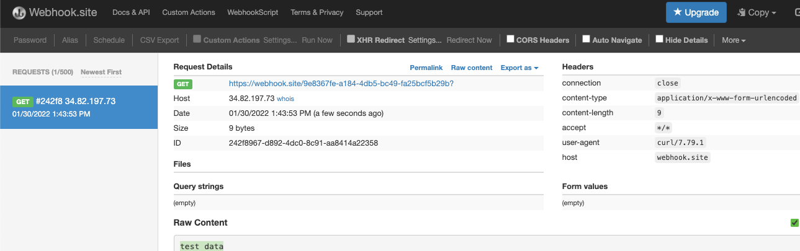

# Exercise 5 - Development workflow

**Disclaimer: Some Keptn funcitonalities are in beta as January 2022**

The goal for this second part of the lab is to learn how to develop new remediation workflows by ***testing each part of the process independently*** and then assembling everything into a single workflow.

## Step 1 - Identify the components

The solution has the following components:

1. Dynatrace problem detection
1. Keptn remediation workflow
1. Remediation script/service 
1. Quality gate evaluation

To accelerate the development process we need a way to test each component isolated from the rest of the architecture. 

## 1. Dynatrace problem detection 
This is probably the most difficult component to test since it would require an application with problems that can be trigger manually. Fortunately, at Dynatrace we have Easytravel (https://confluence.dynatrace.com/community/display/DL/easyTravel), this app includes common performance scenarios that can be trigger on demand.

Another alternative is to develop your own test application based on techical articles depending on the programming language and the type of problem to recreate i.e. (https://michaelscodingspot.com/ways-to-cause-memory-leaks-in-dotnet/)

Another option would be to use Dynatrace API to send a custom alert. Some reference information on this topic: 
- https://www.dynatrace.com/support/help/how-to-use-dynatrace/problem-detection-and-analysis/basic-concepts/event-types/custom-alerts
- https://www.dynatrace.com/support/help/dynatrace-api/environment-api/events-v2/post-event

Exercise:

Run the following script and check in the `Dynatrace UI > services > EasyTravelWebserver:8079`
```(bash)
  /home/$shell_user/perform-2022-hot-aiops/exercises/scripts/create_problem.sh "Critical Performance Issue" PERFORMANCE_EVENT
```
This will create a custom problem notification in the specified Dynatrace service (we are selecting the service based on the tag `app:easy-travel-server`)
## 2.Keptn remediation workflow
Instead of waiting for a problem to be detected by Dynatrace to test your integration you can use the keptn API to send fake problem events to test your workflow.
1. To create a new keptn event run
    ```(bash)
      /home/$shell_user/perform-2022-hot-aiops/exercises/scripts/keptn_event.sh
    ```
    This would trigger an event type `sh.keptn.event.production-disk.auto_healing_disk.triggered` that will execute the workflow 
    ```(yaml)
        - name: "production-disk"
      sequences:
      - name: "auto_healing_disk"
        tasks:
        - name: clean_disk
        - name: evaluation
          triggeredAfter: "2m"
          properties:
            timeframe: "2m"
      - name: "auto_healing_disk_failed"
        triggeredon: auto_healing_disk result = "fail"
        tasks:
        - name: escalate_human
    ```
    (since you haven't subscribe any tasks to this new event, it will automatically return a failure).
1. To avoid returning a failure and test the keptn webhook service you can create a mock subscription using services like https://webhook.site/ or https://pipedream.com/. This would help you validate the contents of the payload and troubleshoot any format issues.
**Tip: You can use the following content in the body to get the keptn_context and event_id as you will need those values to close the task ```"event_id":{{.id}},"sh_keptn_context":"{{.shkeptncontext}}"```


1. To close a problem use the script `keptn_event_finished.sh`. It requires 3 parameters:
   1. triggeredid: Id of the event (check it from the content payload in the webhook response).
   2. shkeptncontext: Keptn context id. This is an internal ID required for keptn.
   3. Result: Can be `pass` or `failed`
- Execute the script using:
    ```(bash)
    /home/$shell_user/perform-2022-hot-aiops/exercises/scripts/keptn_event_finished.sh "triggerid" "shkeptncontext" "result"
    ```

## 3. Remediation script/service 
This part depends on the actual remediation action. It can be a simple script execution or a complex integration with a third party service. For the previous part of the lab we use AWX, you can test it by running manually the `remediation` script from the AWX UI.

## 4. Quality gate evaluation
This is another full HOT session topic. You can learn more about quality gates and SLO/SLI definitions in the following link https://www.dynatrace.com/support/help/how-to-use-dynatrace/cloud-automation/release-validation/get-started-with-quality-gates.

If you want to try runnning a quality gate evaluation on demand run
```
keptn trigger evaluation --project=easytravel --stage=production --service=allproblems --timeframe=60m --labels=executedBy=manual
```


